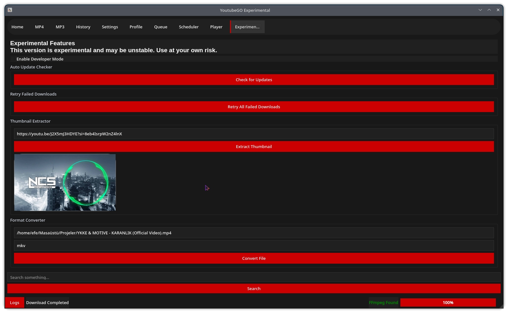

# YoutubeGO Experimental 🚀

**YoutubeGO Experimental** is an advanced, feature-packed YouTube downloader built with [PyQt5](https://pypi.org/project/PyQt5/), powered by [yt-dlp](https://github.com/yt-dlp/yt-dlp). It provides a sleek, customizable interface with extended functionality beyond basic downloaders.

> ⚠️ **Experimental Version:** This version may include unfinished or unstable features. For the stable version, visit [YoutubeGO Stable](https://github.com/Efeckc17/YoutubeGO).

---

## ✨ Features

- 🎥 **Download Modes:**
  - Download videos in MP4 format
  - Download audio in MP3 format
  - Playlist support

- 📥 **Queue & Scheduler:**
  - Queue multiple downloads
  - Schedule downloads at specific times

- 📜 **History Logging:**
  - Keeps detailed download history

- 👤 **User Profile:**
  - Customize profile with name, picture, and social links

- ⚙️ **Settings & Customization:**
  - Dark/Light theme
  - Default resolution & download path
  - Download speed limit

- ▶️ **Built-in Video Player**

- 🧰 **Additional Tools:**
  - Thumbnail extractor
  - Basic file converter (experimental)

- 🐞 **Developer & Verbose Modes**

---

## 📂 Project Structure

```
youtubego/
├── core/
│   ├── downloader.py        # Download logic & Worker classes
│   ├── profile.py           # User profile management
│   ├── theming.py           # Theme functions
│   └── utils.py             # Utility functions
├── ui/
│   ├── main_window.py       # MainWindow Class
│   ├── widgets.py           # Custom PyQt5 widgets
│   └── pages/
│       ├── home.py
│       ├── mp4_page.py
│       ├── mp3_page.py
│       ├── history_page.py
│       ├── settings_page.py
│       ├── profile_page.py
│       ├── queue_page.py
│       ├── scheduler_page.py
│       ├── player_page.py
│       └── experimental_page.py
├── assets/
├── LICENSE
├── main.py                  # Application Entry Point
├── requirements.txt         # Dependencies
└── README.md
```

---

## 🚀 Installation & Usage

### Prerequisites

- **Python:** Version 3.6+
- **FFmpeg:** Required for format conversion & audio extraction ([Download Here](https://ffmpeg.org/download.html))

### Setup

1. **Clone the repository:**

```bash
git clone https://github.com/Efeckc17/YoutubeGO-Experimental.git
cd YoutubeGO-Experimental
```

2. **Install dependencies:**

```bash
pip install -r requirements.txt
```

3. **Run the app:**

```bash
python main.py
```

---

## 🧩 How to Use

1. **Home:** App overview
2. **MP4 / MP3 Pages:** Download videos or audios
3. **Queue:** Manage multiple downloads
4. **Scheduler:** Plan future downloads
5. **History:** View and manage download history
6. **Profile:** Customize user profile
7. **Settings:** Change appearance and app options
8. **Player:** Watch downloaded videos
9. **Experimental:** Extra tools & dev features

---

## 📸 Screenshot



---

## 🙌 Contributing

Contributions are welcome! Feel free to fork the repo and submit pull requests.

---

## 📄 License

This project is licensed under the MIT License. See the [LICENSE](LICENSE) file for details.

---

## 🙏 Acknowledgements

- [yt-dlp](https://github.com/yt-dlp/yt-dlp)
- [PyQt5](https://pypi.org/project/PyQt5/)
- Special thanks to all contributors and users

---

**Note:** This project is under active development. Features may change or be removed in future releases.

